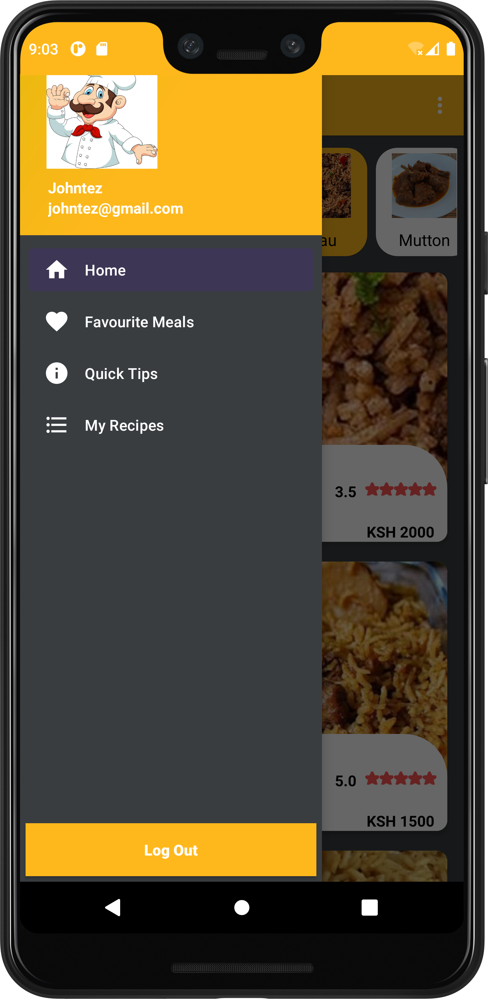
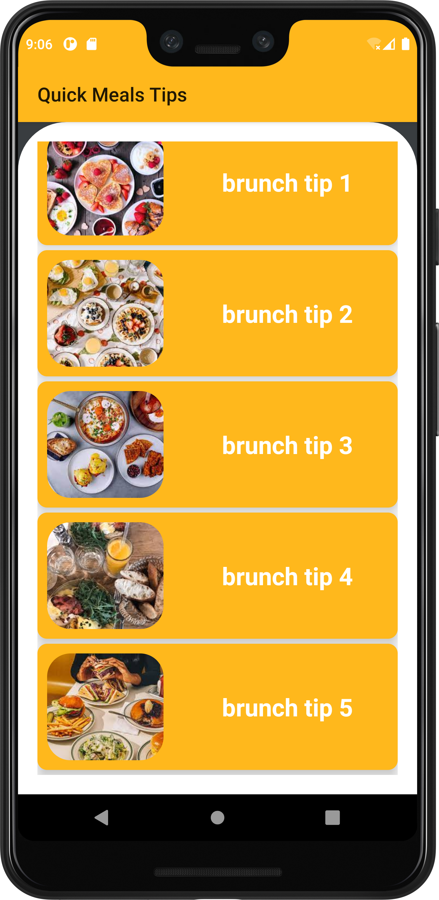

# ChefKlub
A simple android application for food recipes. Users are able to see the approximate cost of a recipe with the amount of time to prepare and also keep their recipes.

## Technologies used
* Java- `Backend.`
* Xmls- `Frontend.`
* Gradle- `(For Project building).`
* Junit- `Testing`

# Screenshots
 

## Prerequisites
- Basic java, Android Studio and Git knowledge, including an installed version of Git.
- Your application must run on the OpenJDK version 11 onwards.

## Setup & Installation
* Clone the project into your machine from `https://github.com/johnkaizer/ChefKlub.git`
* Run the project in the forked root folder- gradle run.

## Development
Want to contribute? Great!
To fix a bug or enhance an existing module, follow these steps:

- Fork the repo
- Create a new branch (`git checkout -b improve-feature`)
- Make the appropriate changes in the files
- Add changes to reflect the changes made
- Commit your changes (`git commit -am 'Improve feature'`)
- Push to the branch (`git push origin improve-feature`)
- Create a Pull Request
